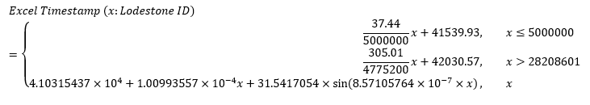

# lodestone-id-time
Data scraper, formula and reference implementation for the estimated creation time of a FFXIV character given its Lodestone ID. This formula can be used to get the creation times for any character, including ones with private achievement data. The creation time is estimated based on the first achievement time of a sample of characters. A web interface is also available [here](https://karashiiro.github.io/lodestone-when/).

The formula is subject to change in the future, as more data is collected.

## Reference implementation
A reference implementation is provided in [reference_impl.py](reference_impl.py).
The numbers used are generated from [estimate.py](estimate.py).

## Formula

## Graph

Mean-squared error (Excel timestamp): 7422.162747

## Notes
* There's a marked slowdown around the beginning of 2020. If this were redone with
  machine learning, it might be smart to include a feature including lockdown data
  or some proxy for it.
* The 2020-Now part of the formula might be better approximated with another
  sinusoidal term, but it's unclear yet if that's the case.
* At the time this graph was constructed, there was a bug in my thread work distribution,
  which resulted in the gaps in the data. It has since been fixed.
