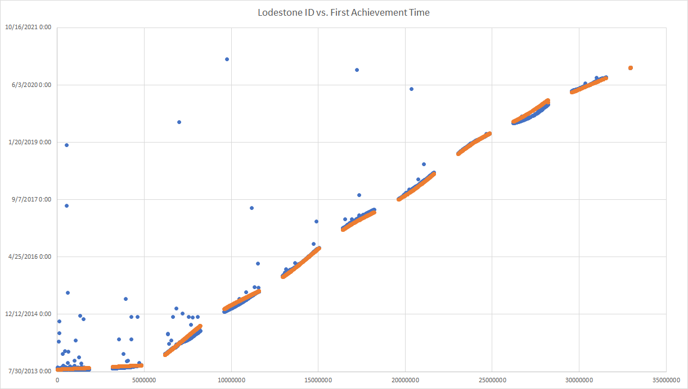

# lodestone-id-time
Estimate the creation time of a FFXIV character based on its Lodestone ID.

## Reference implementation
A reference implementation is provided in [reference_impl.py](reference_impl.py).
The numbers used are generated from [estimate.py](estimate.py).

## Formula

## Graph

## Notes
* There's a marked slowdown around the beginning of 2020. If this were redone with
  machine learning, it might be smart to include a feature including lockdown data
  or some proxy for it.